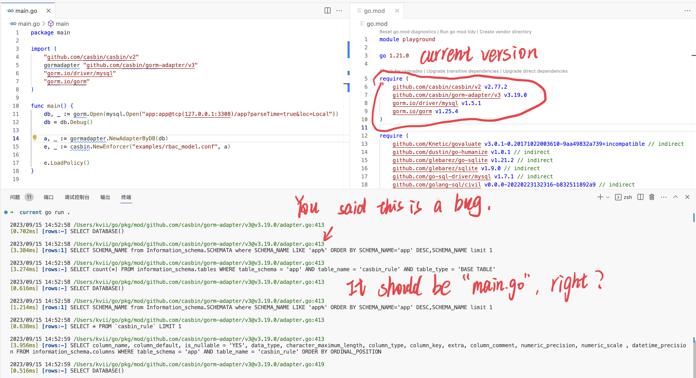
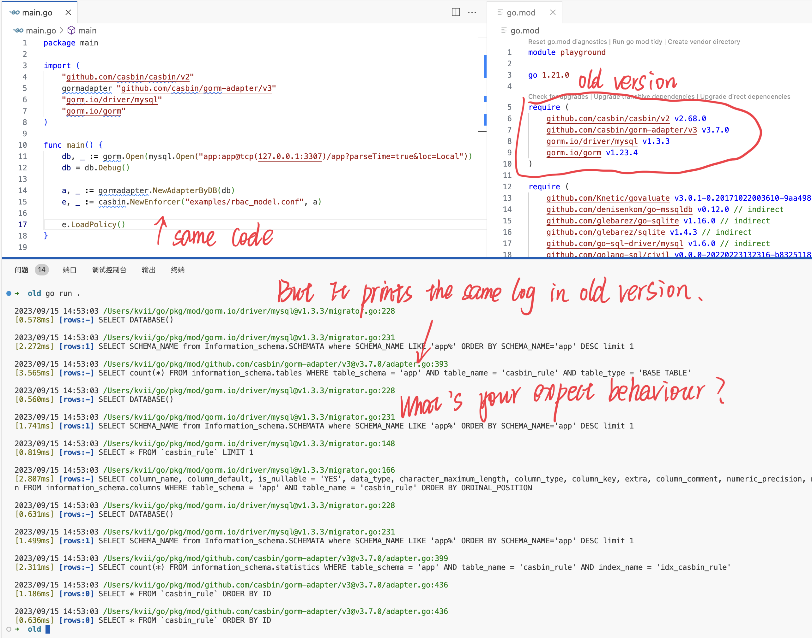

# explain_there_is_no_bug_in_gorm

explain there is no bug in gorm.

## reproduce

1. run code in current version.

```sh
cd current
docker compose up -d
go run .
docker compose down
cd ..
# see the log printed to console.
```

2. run code in old version.

```sh
cd old
docker compose up -d
go run .
docker compose down
cd ..

# see the log printed to console.
```

## screenshots




